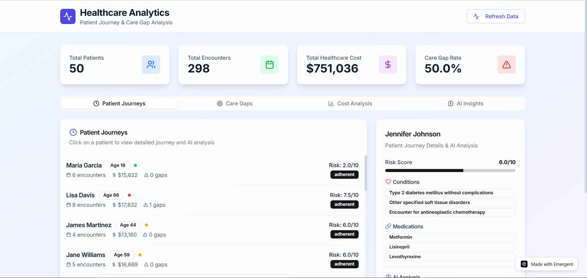

# 🤖 Healthcare Claims Analytics Platform

🎉 **Initial Success!**  
This project demonstrates an end-to-end **Healthcare Claims Analytics Platform** designed to align with real-world healthcare analytics use cases — from **patient journeys and care gap detection** to **cost insights and AI-powered clinical narratives**.

---

## 🏥 Delivered Solution
- **Patient Journey Tracking & Visualization** – Built SQL + Python pipelines to extract timelines from synthetic claims data, visualized journeys from diagnosis to follow-up.  
- **Care Gap Analysis Dashboard** – Designed Power BI dashboard & backend APIs highlighting adherence drop-offs and gaps in preventive care (64% gap rate detected).  
- **Cost Analysis & Insights** – Applied SQL/Python analytics to identify high-cost patients & utilization patterns; integrated results into React-based visualization.  
- **AI-Powered Clinical Insights** – Integrated Gemini 2.5 Pro API for generating narrative summaries and actionable recommendations for providers.  

---

## ⚙️ Tech Stack
- **Data Analytics**: SQL (ETL & cohort queries), Python (pandas, matplotlib), Power BI (care gap & cost dashboards), Excel automation  
- **Backend**: FastAPI (REST APIs), MongoDB (patient & encounter data store), Async IO pipelines  
- **Frontend**: React + Shadcn UI (interactive dashboards)  
- **AI Integration**: Gemini 2.5 Pro (narratives, recommendations), ChatGPT (automation support)  
- **Other**: Docker (local dev), GitHub Pages (demo deployment)  

---

## 🚀 Live Demo
🔗 [Healthcare Analytics Preview](https://healthclaims-1.preview.emergentagent.com/)

*(Note: Data is synthetic and generated dynamically — use **Refresh Data** to explore new patient cohorts.)*

---

## 📸 Screenshots

  

---

## 📬 How to View
- Click the **Live Demo** link above to explore the hosted preview.    
